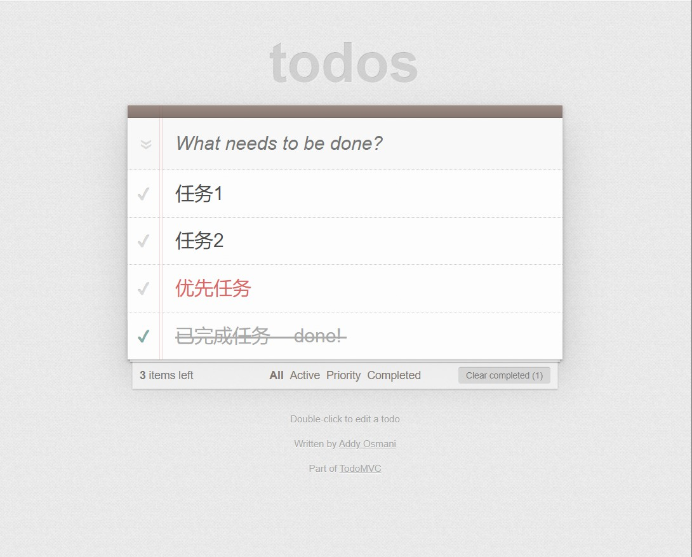

## 项目概要

该项目是优达学城 [JavaScript 设计模式](https://cn.udacity.com/course/javascript-design-patterns--ud989-enterprise) 课程4 **Exploring Unfamiliar Code** 的项目，旨在基于对 MV* 多种模型的相似设计模式，快速了解不熟悉的框架并对其进行修改实现所需功能。

项目应用参考自 [TodoMVC](http://todomvc.com/)，是一个基于 [Backbone.js](http://todomvc.com/examples/backbone)、[jQuery](http://todomvc.com/examples/jquery)、[Underscore.js](http://underscorejs.org/) 创建的待办清单网页应用。



### 使用方法

下载文件或克隆仓库到本地

```shell
git clone 
```

## 新增功能

* 为每一条目添加编辑按钮（也可以双击条目进行编辑）
* 为每一条目添加优先标记
* 新增优先条目筛选归类